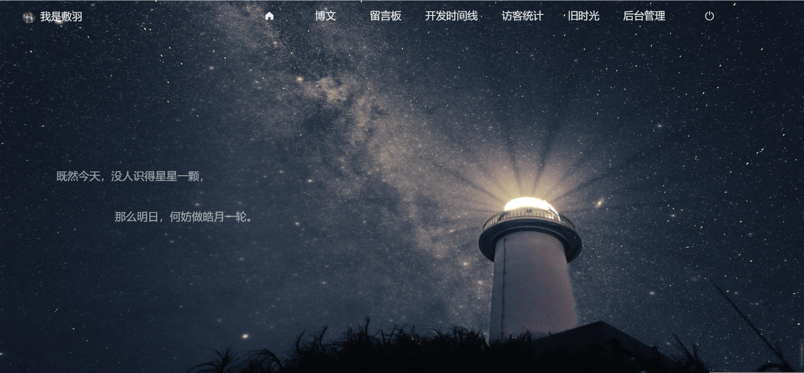

# FishBuild

###### 已完成：我是敷羽、 主页 、404页面、  导航栏、 导航卡、 公告栏、 版权栏、 关闭/开始页面

###### 未完成：博文、 留言板、 开发时间线、 访客统计、 旧时光、 后台管理

###### 时间 2022-08-24

#### 404页面：STAR、文字

####  我是敷羽

#### 主页：STAR、文字

#### 导航栏：滚动变色

#### 导航卡：头像环绕

#### 公告栏

#### 版权栏

#### 关闭/开始页面：fake-3d image、popup弹窗
